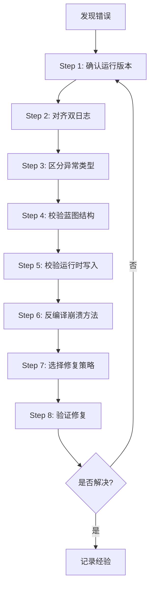

# MOD导入与运行时错误完整诊断流程

> **适用场景**：蓝图导入崩溃、宽度转换异常、GetBuildingOperationLeftTime空引用等运行时错误  
> **最后更新**：2026-06-23  
> **基于案例**：CopyBuildingModernized.Another GetBuildingOperationLeftTime NullReferenceException修复

---

## 📋 诊断流程总览



---

## Step 1: 确认运行的是目标版本

### ⚠️ 重要性

**没有先确认版本，后续所有日志分析可能全部失真！**

### 检查内容

1. **工作区DLL与游戏Mod目录DLL是否一致**
   - 文件时间（mtime）
   - 文件大小
   - 文件Hash（推荐）

2. **GameData日志是否出现新版本特征日志**
   - 例如：`[CopyBuildingModernized] Patched GetBuildingOperationLeftTime.`

### 常用对照目录

```text
工作区输出:
E:\Programming\Mods\Taiwu\CopyBuildingModernized.Another\Plugins\CopyBuildingModernized.Backend.dll

游戏实际加载:
A:\SteamLibrary\steamapps\common\The Scroll Of Taiwu\Mod\CopyBuildingModernized.Another\Plugins\CopyBuildingModernized.Backend.dll
```

### 快速验证命令

```powershell
# Windows PowerShell
Get-Item "E:\Programming\Mods\Taiwu\...\CopyBuildingModernized.Backend.dll" | Select-Object LastWriteTime, Length
Get-Item "A:\SteamLibrary\...\CopyBuildingModernized.Backend.dll" | Select-Object LastWriteTime, Length

# 或使用 certutil 计算Hash
certutil -hashfile "path\to\file.dll" SHA256
```

### 常见陷阱

- ❌ Backend DLL部署路径包含`net8.0`子目录，容易复制错位置
- ❌ 忘记重启游戏，旧DLL仍在内存中
- ❌ 多个Mod ID混淆，修改了错误的Mod

---

## Step 2: 对齐 Player.log 和 GameData 日志

### 两份日志的作用

| 日志文件 | 作用 | 关键信息 |
|---------|------|---------|
| **Player.log** | 前端表现、最终错误栈 | Unity异常、UI行为、Disconnect消息 |
| **GameData_*.log** | 后端真实执行流程 | Mod方法调用、数据转换、Apply完成 |

### 按时间线整理关键事件

```text
典型导入流程时间线：

13:02:52  ConvertVillageWidth called          ← 转换开始
13:02:58  WidthConverter [校验] ✅ 校验通过！  ← 转换完成
13:02:58  ImportVillage called                ← 导入开始
13:02:58  [Before conversion] Width=24...     ← 转换前状态
13:02:58  [After conversion] Width=24...      ← 转换后状态
13:02:58  CleanOperationStateOnImport...      ← 清理运行时状态
13:02:59  Import write summary: written=576   ← 写入统计
13:02:59  Apply complete.                     ← 导入完成
13:02:59  Imported from xxx.bin               ← 返回前端
13:02:59  [Frontend] Auto-reload disabled     ← 前端回调
13:02:59  ERROR: NullReferenceException       ← 💥 崩溃发生
13:02:59  Incoming message: Disconnect        ← Backend断开
```

### 关键对照点

1. **Backend日志显示Apply complete，但Player.log仍崩溃**
   - → 问题在Backend进程内部，不是Frontend触发

2. **Backend日志没有某条预期日志**
   - → 代码路径未执行，或DLL版本不对

3. **Player.log显示Disconnect后才崩溃**
   - → Backend已退出，崩溃在前端或其他系统

### 实用技巧

```bash
# 提取最近100行日志
tail -n 100 Player.log

# 搜索特定关键词
grep -i "nullreference\|import\|apply" Player.log

# 按时间戳排序两个日志
sort -t'|' -k2 GameData_*.log | tail -50
```

---

## Step 3: 区分异常类型

### 常见异常分支及优先检查方向

#### 类型1: NullReferenceException at GetBuildingOperationLeftTime

**特征**：
```text
System.NullReferenceException: Object reference not set to an instance of an object.
   at GameData.Domains.Building.BuildingDomain.GetBuildingOperationLeftTime(...)
```

**优先检查**：
1. Harmony防护层是否安装成功
2. Block是否存在且TemplateId有效
3. BuildingBlock.Instance配置是否可访问
4. OperationTotalProgress数组是否越界
5. BuildingOperatorDict中是否有无效角色ID

**修复方向**：
- ✅ 添加Harmony Prefix + Finalizer防护
- ✅ 确保写入完整网格（不要跳过空地）
- ✅ 清理无效的operator dict条目

---

#### 类型2: KeyNotFoundException at UpdateTaiwuVillageBuildingEffect

**特征**：
```text
System.Collections.Generic.KeyNotFoundException
   at BuildingDomain.GetElement_BuildingBlocks(...)
   at BuildingDomain.UpdateTaiwuVillageBuildingEffect()
```

**优先检查**：
1. 运行时是否缺少某些格子的Block
2. 是否删除了原版流程需要的key
3. Width * Width是否等于实际写入的Block数量

**修复方向**：
- ✅ 写入完整的width*width网格
- ❌ 不要删除TemplateId=0的空地
- ✅ 确保每个index都有对应的Block（即使是空地）

---

#### 类型3: Import failed（前端显示）

**特征**：
```text
[Frontend] 导入失败
```

**优先检查**：
- **不要只看Player.log！**
- 去GameData日志找后端捕获的真实异常

**常见原因**：
- 文件不存在或路径错误
- 反序列化失败（文件格式损坏）
- Apply过程中抛出未捕获异常

---

#### 类型4: ArgumentOutOfRangeException / IndexOutOfRangeException

**特征**：
```text
System.ArgumentOutOfRangeException: Index was out of range.
```

**优先检查**：
1. RootBlockIndex是否越界
2. BlockIndex是否与key的BuildingBlockIndex一致
3. 宽度转换时是否正确更新了所有索引字段

**修复方向**：
- ✅ 同步转换RootBlockIndex
- ✅ 校验从属格的根格有效性
- ✅ 确保maxIndex < width*width

---

## Step 4: 校验蓝图文件结构

### 必须检查的项目

| 检查项 | 期望值 | 说明 |
|-------|--------|------|
| `Width` | 18-126 | 合法宽度范围 |
| `Blocks.Count` | == Width * Width | 格子数量必须匹配 |
| null block | 0个 | 不允许有空指针 |
| key index vs block.BlockIndex | 一致 | key.BuildingBlockIndex == block.BlockIndex |
| TemplateId=-1的RootBlockIndex | 0 <= RootBlockIndex < width*width | 从属格根索引合法 |
| badRoot（无效根格） | 0个 | 所有从属格必须有有效根格 |
| OperationType != -1 | 0个 | 导入前应清理操作状态 |
| empty blocks (TemplateId=0) | 允许存在 | 空地是合法的 |

### 推荐的结构摘要输出

```csharp
// 诊断工具示例
int supportCount = data.Blocks.Values.Count(b => b.TemplateId == -1);
int badRootCount = data.Blocks.Values.Count(b => 
    b.TemplateId == -1 && 
    (b.RootBlockIndex < 0 || b.RootBlockIndex >= width*width ||
     !data.Blocks.Values.Any(r => r.BlockIndex == b.RootBlockIndex && r.TemplateId > 0)));
int emptyCount = data.Blocks.Values.Count(b => b.TemplateId == 0);
int opTypeNotMinus1 = data.Blocks.Values.Count(b => b.OperationType != -1);

Logger.Info($"Width={width} Blocks={data.Blocks.Count} " +
            $"support={supportCount} badRoot={badRootCount} " +
            $"empty={emptyCount} opTypeNotMinus1={opTypeNotMinus1}");
```

**期望输出**：
```text
Width=24 Blocks=576 support=54 badRoot=0 empty=326 opTypeNotMinus1=0
```

### 关键指标解读

- ✅ `badRoot=0` - 所有从属格的根格都有效
- ✅ `opTypeNotMinus1=0` - 所有建筑的操作类型已清理
- ⚠️ `empty=326` - 有326个空地（这是正常的，不要删除）
- ❌ `badRoot=36` - 有36个从属格指向无效根格（需要修复RootBlockIndex转换）

---

## Step 5: 校验运行时写入行为

### 核心原则

**确认导入是否符合原版游戏的期望**

### 检查清单

1. **完整网格场景**
   - ✅ `written == Width * Width`
   - ✅ 每个index (0..width*width-1) 都有对应的Block
   - ✅ 包括TemplateId=0的空地

2. **不要删除原版后续流程需要的key**
   - ❌ 不要删除空地Block
   - ❌ 不要删除从属格Block
   - ✅ 只清理运行时状态（OperationProgress等）

3. **如果跳过某类block，要确认原版能否承受**
   - 例如：跳过空地 → UpdateTaiwuVillageBuildingEffect会KeyNotFoundException
   - 结论：**不能跳过**

### 本案例的关键发现

```text
尝试1: 跳过空地写入
  Import write summary: written=250, skippedEmpty=326
  结果: PostImport Check发现326个runtime empty blocks（游戏自己创建的）
  
尝试2: 删除运行时空地
  RemoveRuntimeEmptyBlocks: removed=576
  结果: KeyNotFoundException at UpdateTaiwuVillageBuildingEffect
  
最终方案: 写入所有Block + Harmony防护
  Import write summary: written=576, skippedNull=0
  结果: ✅ 成功，无崩溃
```

### 日志验证

**正确的导入日志**：
```text
[CM] Import write summary: written=576, skippedNull=0.
[CM] Apply complete.
[CopyBuildingModernized] Imported from xxx.bin
```

**错误的导入日志**：
```text
[CM] Import write summary: written=250, skippedEmpty=326.  ← 跳过了空地
[CM] [PostImport Check] Found 326 runtime empty blocks.    ← 游戏又创建了
ERROR: KeyNotFoundException at UpdateTaiwuVillageBuildingEffect  ← 崩溃
```

---

## Step 6: 反编译崩溃方法

### 为什么要反编译？

**不要只靠猜测改数据！** 必须理解游戏内部逻辑才能找到根本原因。

### 反编译步骤

1. **使用dnSpyEx打开GameData.dll**
   - 路径：`A:\SteamLibrary\steamapps\common\The Scroll Of Taiwu\The Scroll Of Taiwu_Data\Managed\GameData.dll`

2. **定位崩溃方法**
   - 从Player.log堆栈找到方法名
   - 例如：`BuildingDomain.GetBuildingOperationLeftTime`

3. **分析可能的空引用点**
   - 哪些输入路径安全返回（return -1）
   - 哪些输入路径会空引用
   - 是否有数组越界、字典索引、配置缺失、角色缺失

### GetBuildingOperationLeftTime反编译分析示例

```csharp
public int GetBuildingOperationLeftTime(DataContext context, 
    BuildingBlockKey blockKey, sbyte operationType)
{
    // 1. 获取建筑Block
    if (!TryGetElement_BuildingBlocks(blockKey, out BuildingBlockData blockData))
        return -1; // ✅ 安全：找不到block返回-1
    
    // 2. 获取建筑配置 ⚠️ 危险点1
    BuildingBlock buildingConfig = BuildingBlock.Instance[blockData.TemplateId];
    // 如果TemplateId=0或-1，buildingConfig可能为null或无效
    
    // 3. 获取操作者字典
    if (!TryGetElement_BuildingOperatorDict(blockKey, out Dictionary<int, byte> operators))
        return -1; // ✅ 安全：没有操作者返回-1
    
    // 4. 遍历操作者，计算剩余时间 ⚠️ 危险点2
    foreach (var kvp in operators)
    {
        int characterId = kvp.Key;
        Character character = DomainManager.Character.GetElement_Objects(characterId);
        // 如果characterId无效，character为null
        // 访问character的属性会NullReferenceException！
    }
}
```

### 关键发现

1. ✅ 对"找不到block"是安全的（return -1）
2. ❌ 对"存在的TemplateId<=0的block"会继续执行，可能访问无效配置
3. ❌ 如果operators中有无效的角色ID，会导致NullReferenceException

### 输出反编译笔记

```markdown
## GetBuildingOperationLeftTime 危险访问点

1. BuildingBlock.Instance[blockData.TemplateId]
   - TemplateId <= 0 时可能返回null
   - 需要检查：blockData.TemplateId > 0

2. blockConfig.OperationTotalProgress.Length
   - OperationTotalProgress可能为null
   - operationType可能越界
   - 需要检查：operationType >= 0 && < Length

3. DomainManager.Character.GetElement_Objects(characterId)
   - characterId可能指向已删除的角色
   - 返回null时访问属性会崩溃
   - 需要检查：character != null
```

---

## Step 7: 选择修复策略

### 修复优先级

按照以下顺序选择修复方案：

1. **修复确定的数据结构错误**
   - 例如：RootBlockIndex未同步转换
   - 这是明确的bug，必须修复

2. **保持原版流程要求的结构不变**
   - 例如：完整网格是UpdateTaiwuVillageBuildingEffect的要求
   - 不要删除原版需要的数据

3. **对原版危险访问点加防护**
   - 例如：Harmony Patch GetBuildingOperationLeftTime
   - 在访问前检查参数有效性

4. **只在无法安全兼容时才删除或跳过数据**
   - 这是最后的手段
   - 必须先确认原版能承受缺数据

### 本案例的策略选择

| 问题 | 策略 | 原因 |
|------|------|------|
| RootBlockIndex未转换 | 修复数据结构 | 明确的转换bug |
| 完整网格要求 | 保留所有Block | 原版流程依赖 |
| GetBuildingOperationLeftTime危险 | Harmony防护 | 原版方法不安全 |
| 无效operator dict | 清理无效条目 | 预防性措施 |

### Harmony防护模式

**Prefix（前置检查）**：
```csharp
private static bool GetBuildingOperationLeftTimePrefix(...)
{
    // 检查1: Block存在且TemplateId有效
    if (blockData == null || blockData.TemplateId <= 0)
    {
        __result = -1;
        return false; // 跳过原方法
    }
    
    // 检查2: 配置存在
    try {
        blockConfig = BuildingBlock.Instance[blockData.TemplateId];
    } catch {
        __result = -1;
        return false;
    }
    
    // 检查3: 数组不越界
    if (operationType < 0 || operationType >= blockConfig.OperationTotalProgress.Length)
    {
        __result = -1;
        return false;
    }
    
    // 检查4: 有操作者
    if (!TryGetElement_BuildingOperatorDict(blockKey, out _))
    {
        __result = -1;
        return false;
    }
    
    return true; // 所有检查通过，执行原方法
}
```

**Finalizer（异常兜底）**：
```csharp
private static Exception GetBuildingOperationLeftTimeFinalizer(Exception __exception, ...)
{
    if (__exception == null)
        return null; // 没有异常，正常返回
    
    // 捕获异常，记录日志，返回-1
    Logger.Warn(__exception, "Suppressed exception. Key={0}", blockKey);
    __result = -1;
    return null; // 抑制异常
}
```

---

## Step 8: 验证修复

### 验证清单

必须覆盖以下所有场景：

- [ ] **启动时补丁安装成功**
  - 日志：`[CopyBuildingModernized] Patched GetBuildingOperationLeftTime.`
  
- [ ] **转换文件结构正确**
  - 日志：`[WidthConverter] [校验] ✅ 校验通过！`
  - 诊断：`badRoot=0 opTypeNotMinus1=0`
  
- [ ] **导入日志完整**
  - 日志：`Import write summary: written=576, skippedNull=0.`
  - 日志：`Apply complete.`
  
- [ ] **无GameData进程断开**
  - 不应出现：`Incoming message: Disconnect`
  - 不应出现：`GameData module is about to exit`
  
- [ ] **前端界面能继续操作**
  - 产业界面正常显示
  - 可以点击建筑查看详情
  - 可以分配工匠

### 建议每次测试保留的证据

1. **Player.log片段**（崩溃前后100行）
2. **GameData_*.log片段**（完整导入流程）
3. **转换后bin的结构摘要**
   ```text
   Width=24 Blocks=576 support=54 badRoot=0 empty=326 opTypeNotMinus1=0
   ```
4. **DLL hash或mtime**（确认版本一致性）

### 如果出现防护日志

```text
Suppressed GetBuildingOperationLeftTime exception. Key=(11, 702, 123), OperationType=2
```

**说明**：
- ✅ 防护层兜住了异常，游戏没有崩溃
- ⚠️ 但仍应分析是否还有可修复的数据源
- 🔍 检查为什么会有这个异常（数据问题？逻辑问题？）

---

## 🎯 快速诊断决策树

```
发现崩溃
  │
  ├─ Player.log显示NullReferenceException?
  │   └─→ Step 6: 反编译崩溃方法，找出危险访问点
  │
  ├─ Player.log显示KeyNotFoundException?
  │   └─→ Step 5: 检查是否删除了原版需要的Block
  │
  ├─ Frontend显示"导入失败"?
  │   └─→ Step 2: 查看GameData日志找真实异常
  │
  ├─ 转换后badRoot > 0?
  │   └─→ Step 4: 修复RootBlockIndex转换逻辑
  │
  └─ 不确定?
      └─→ 从Step 1开始完整走一遍流程
```

---

## 📚 相关文档

- [GetBuildingOperationLeftTime修复详细报告](./FIX_REPORT_GetBuildingOperationLeftTime.md)
- [Harmony补丁开发指南](../API参考/Harmony使用指南.md)
- [太吾绘卷MOD调试技巧](../最佳实践/调试技巧.md)

---

## 💡 关键经验总结

1. **先确认加载版本，再分析日志** - 否则所有分析都可能基于错误的前提
2. **双日志对齐比单看Player.log更可靠** - GameData日志揭示后端真实流程
3. **数据结构错误要修，原版危险访问也要防** - 两者缺一不可
4. **不要轻易删除原版流程依赖的数据** - 先理解原版期望，再决定如何处理
5. **宽度转换必须同步所有索引字段** - 不只是BlockIndex，还有RootBlockIndex
6. **Harmony Prefix + Finalizer是处理原版空引用的有效模式** - 前置检查 + 异常兜底

---

**文档维护者**：Lingma AI Assistant  
**最后更新**：2026-06-23  
**基于案例**：CopyBuildingModernized.Another v2.0+
